# Architecture Overview (M0)

This document defines the initial architecture and contracts for an event‑driven Order Management System to be deployed on Kubernetes.

## Services (Bounded Contexts)

- Gateway: Public HTTP API. Validates input, calls Orders service for create/get. No direct DB access.
- Orders: System of record for orders. Persists orders, emits domain events, reacts to inventory/payment events to advance state.
- Inventory: Manages stock/availability. Reserves/reverts inventory based on order events.
- Payments (later): Authorizes/captures payments; emits payment outcomes.
- Fulfillment (later): Prepares and delivers orders based on paid events.

Each service owns its database. Cross‑service communication is event‑driven via Kafka; occasional synchronous calls use gRPC.

### Visual: System Context

## Interaction Model

- External client → Gateway (HTTP):
  - POST /orders: Create order (returns 201 + orderId); gateway calls Orders synchronously to persist PENDING and trigger event emission.
  - GET /orders/{orderId}: Query status (gateway calls Orders synchronously).
- Internal services → Kafka:
  - Orders publishes order.v1 events (Created, Validated, Paid, Cancelled).
  - Inventory publishes inventory.v1 events (Reserved, Rejected).
  - Payments publishes payment.v1 events (Authorized, Failed).
  - Orders consumes inventory/payment events to drive the order state machine.

### Visual: Create Order Saga (Happy and Failure Paths)

## Order State Machine (v1)

- PENDING: Created by Orders when a request arrives. Emits OrderCreated.
- VALIDATED: Orders updates to VALIDATED when InventoryReserved received.
- PAID: Orders updates to PAID when PaymentAuthorized received.
- CANCELLED: If InventoryRejected or PaymentFailed, Orders moves to CANCELLED with reason.

Optional later: PREPARING, COMPLETED (by Fulfillment).

### Visual: Order State Machine

## Messaging

- Broker: Kafka (Strimzi on K8s). At‑least‑once delivery, consumer groups per service.
- Topics (keyed by orderId for partition affinity):
  - oms.order.v1
  - oms.inventory.v1
  - oms.payment.v1
- Events are Protobuf messages. Each includes a standard Meta envelope for traceability.
- Retention: dev default; prod tuned. DLQ topics (e.g., oms.order.v1.dlq) added later.

### Visual: Topics and Event Flow

## Data Stores (initial)

- Orders: Postgres (schema migrations via migrate/goose). Tables: orders, order_items, idempotency (for POST create).
- Inventory: Postgres (items, reservations).
- Payments: Postgres (payments).

## Reliability & Observability (foundations)

- Idempotency: 
  - Create Order uses Idempotency‑Key header; stored in Orders DB.
  - Consumers are idempotent using orderId key and state checks.
- Outbox pattern: planned for M7; begin with simple producer + transactional semantics where possible.
- Tracing: OpenTelemetry across HTTP → gRPC → Kafka; propagate trace context in Meta.
- Health/Readiness: HTTP probes per service; graceful shutdown.

## K8s Deployment Approach (learning‑first)

- Start with `kind` cluster, Kustomize overlays (dev/prod).
- Deploy Gateway first; then Orders + Postgres; then Kafka via Strimzi; then Inventory.

### Visual: Kubernetes (dev) Layout

